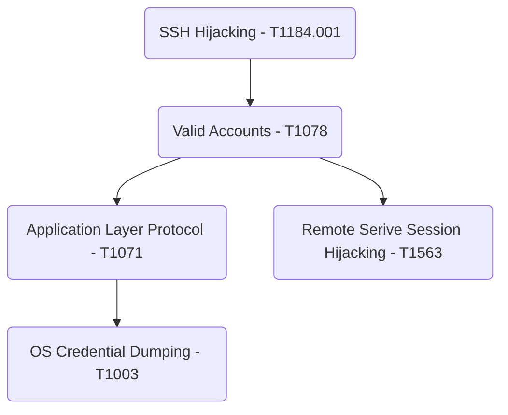
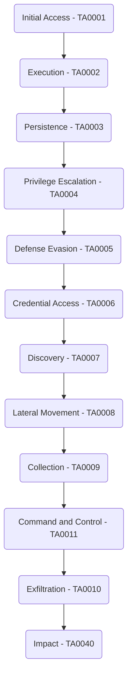

## Mermaid 
### Test 1

```mermaid
graph TD;
T184(SSH Hijacking - T1184.001)-->T1078(Valid Accounts - T1078)
T1078-->T1071(Application Layer Protocol - T1071)
T1071-->T1003(OS Credential Dumping - T1003)
T1078-->T1563(Remote Serive Session Hijacking - T1563)
```
### Test 2

```mermaid 
graph TD;
A(Initial Access - TA0001)-->B(Execution - TA0002)
B -->C(Persistence - TA0003)
C -->D(Privilege Escalation - TA0004)
D -->E(Defense Evasion - TA0005)
E -->F(Credential Access - TA0006)
F -->G(Discovery - TA0007)
G -->H(Lateral Movement - TA0008)
H -->I(Collection - TA0009)
I -->J(Command and Control - TA0011)
J -->K(Exfiltration - TA0010)
K -->L(Impact - TA0040)
```